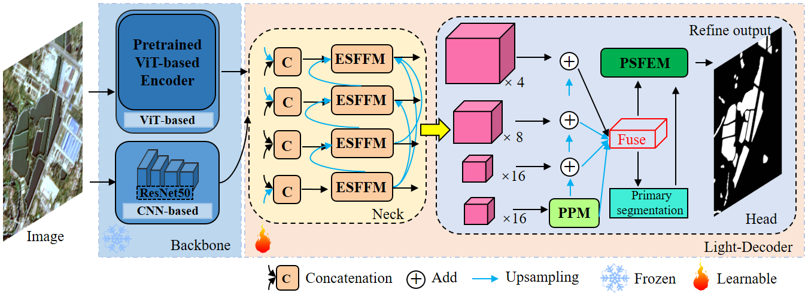

# ESFFM

## Title of paper to be published

Enhanced Semantic-positional Feature Fusion Network via Diverse Pre-trained Encoders for Remote Sensing Image Water-body Segmentation
   

## The challenge of water-body extraction from remote sensing images  
High-resolution satellite and aerial remote sensing imagery (RSI) provide detailed mapping of Earth's surface, revealing 
diverse water-body characteristics such as shape, size, texture, color, scale, and location. This complexity hinders
precise water body mapping, essential for water resource management, flood monitoring, and cartography. Despite advancements 
in feature extraction, fusion, and result refinement, current deep learning methods for water-body extraction from 
high-resolution RSI face three key issues: limited dataset diversity, poor model generalization across diverse datasets,
and inadequate integration of prior research findings, leading to redundant solutions and missed cumulative improvements.

     
    Fig.1.  Rich samples of Earth’s surface water bodies from GenFen-1 (GF1) satellite imagery. 

## Brief description of the proposed method
To alleviate these problems above, Our study introduces ESFFNet, a lightweight network for RSI semantic segmentation. 
It utilizes pre-trained ViT and CNN encoders to extract deep semantic and precise positional features. The Enhanced 
Semantic-positional Feature Fusion Module (ESFFM) merges these features using multi-scale fusion and dense connectivity. 
The Primary Segmentation-guided Fine Extraction Module (PSFEM) further refines segmentation precision. Evaluated on 
water-body datasets, ESFFNet outperforms other methods and demonstrates effectiveness in tasks like building extraction 
and land cover classification. The entire light-weight decoder has a parameter size of less than 4M.

     
    Fig.2.  Enhanced Semantic-positional Feature Fusion Network (ESFFNet) via diverse pre-trained encoders for remote
sensing image water-body segmentation. 

## Others

We will soon release our source codes once our work is accepted. Thank you very much for your interest in our work. 
We hope our research will bring new perspectives and methods to the field of semantic segmentation and change detection
of remote sensing imagery.

